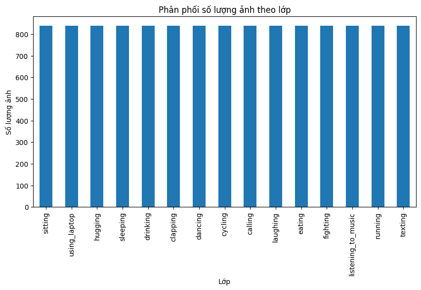
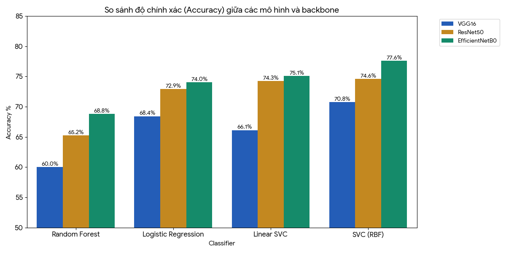
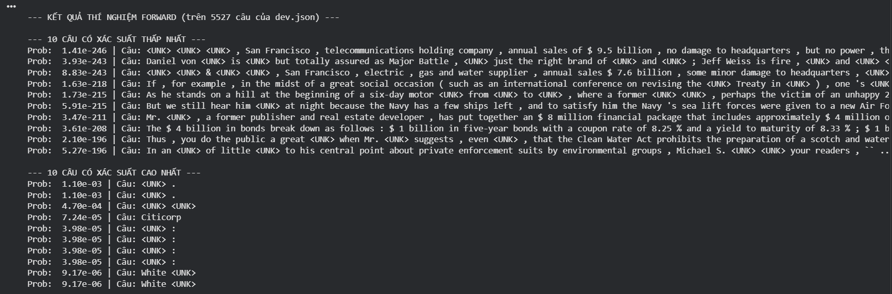
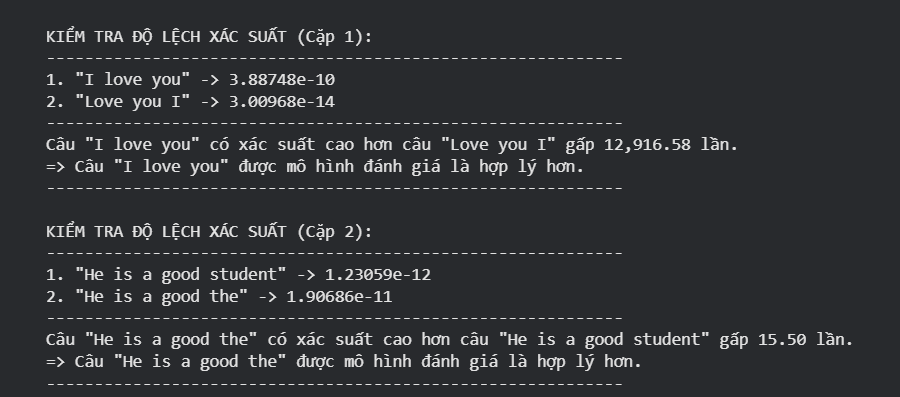
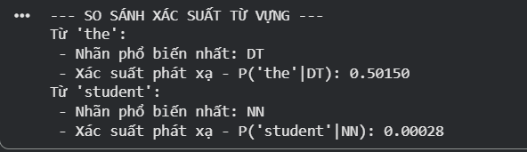

# Bài Tập Lớn Học Máy – CO3117 (Nhóm CEML2, Lớp TN01)

## Thông tin môn học
- **Tên môn học:** Học Máy  
- **Mã môn:** CO3117  
- **Lớp:** TN01 – Nhóm CEML2  
- **Học kỳ:** 251, Năm học 2025 – 2026  

## Giảng viên hướng dẫn
- **TS. Lê Thành Sách**

## Thành viên nhóm
- **Trương Thiên Ân** – 2310190 – an.truong241105@hcmut.edu.vn  
- **Lại Nguyễn Hoàng Hưng** – 2311327 – hung.lai2805@hcmut.edu.vn  
- **Nguyễn Tô Quốc Việt** – 2313898 – viet.nguyenluminous@hcmut.edu.vn  

---

## Mục tiêu bài tập lớn
 1. Hiểu và áp dụng được quy trình pipeline học máy truyền thống, bao gồm: tiền xử lý dữ liệu, trích xuất đặc trưng, huấn luyện và đánh giá mô hình.
 2. Rèn luyện kỹ năng triển khai mô hình học máy trên các loại dữ liệu khác nhau: bảng, văn bản, và ảnh.
 3. Phát triển khả năng phân tích, so sánh, và đánh giá hiệu quả của các mô hình học máy thông qua các chỉ số đo lường.
 4. Rèn luyện kỹ năng lập trình, thử nghiệm, và tổ chức báo cáo khoa học
 
## Assignment 1
### Mục tiêu bài tập
1. **Xử lý dữ liệu đầu vào**  
   - Thực hành xử lý giá trị thiếu (*missing values*) bằng kỹ thuật imputation.  
   - Thực hành mã hóa biến phân loại (*categorical features*) bằng kỹ thuật encoding.  

2. **Xây dựng pipeline học máy cho dữ liệu dạng bảng (Tabular Data)**  
   - Chuẩn hóa dữ liệu bằng các kỹ thuật impute và encoding.  
   - Lựa chọn và thực hiện giảm chiều dữ liệu bằng PCA (nếu cần).  
   - Áp dụng các mô hình học máy (ví dụ: Logistic Regression, SVM, Random Forest).  

3. **So sánh và đánh giá mô hình**  
   - So sánh hiệu quả giữa các mô hình đã huấn luyện.  
   - Đưa ra báo cáo kết quả: phân tích dữ liệu (EDA), mô tả pipeline, cấu hình các bước xử lý, và đánh giá.  
---

### Dataset
- **Tên:** *Mobile Phones in Indian Market Datasets*  
- **Nguồn:** [Kaggle Link](https://www.kaggle.com/datasets/kiiroisenkoxx/2025-mobile-phones-in-indian-market-datasets/data?select=mobiles_uncleaned.csv)  
- **Mô tả:** 11.786 mẫu, 14 thuộc tính về đặc điểm kỹ thuật và thông tin của các dòng điện thoại.  
- **Mục tiêu:** phân loại điện thoại theo giá (`low / medium / high`).  

**Cách tải dataset trong Colab:**  
Dataset đã được push lên GitHub, đã được cấu hình sẵn trong notebook để đảm bảo sẽ tự động tải sau khi nhấn Run Time -> Run all
### Mô tả các module
- **`__init__.py`**:  
  Khai báo và gom tất cả hàm trong `feature_extractors.py` để tiện import (`extract_is_dual_sim`, `extract_cpu_speed`, `extract_ram`, ...).  

- **`feature_extractors.py`**:  
  Chứa các hàm *feature engineering* để trích xuất đặc trưng từ dữ liệu thô (chuỗi văn bản) thành dạng số:  
  - `extract_is_dual_sim`, `extract_is_5g`, `extract_is_nfc`  
  - `extract_cpu_brand`, `extract_cpu_speed`, `extract_cpu_core`  
  - `extract_ram`, `extract_rom`, `extract_battery`, `extract_fast_charging`  
  - `extract_screen_size`, `extract_refresh_rate`, `extract_ppi`  
  - `extract_rear`, `extract_front_camera`  
  - `extract_expandable_storage`, `extract_os`  

- **`model_runner.py`**:  
  Định nghĩa hàm `run_model(...)` để xây dựng pipeline:  
  - Tiền xử lý dữ liệu (imputation, scaling, encoding).  
  - Giảm chiều dữ liệu bằng PCA.  
  - Huấn luyện mô hình (Logistic Regression, SVM, Random Forest).  
  - Trả về metrics (Accuracy, Precision, Recall, F1, Explained Variance %).

-----
## Assignment 2 
### Mục tiêu bài tập
1. **Xử lý dữ liệu đầu vào**  
   - Làm sạch văn bản: loại bỏ ký tự đặc biệt, chuẩn hóa chữ thường.
   - Thực hiện tokenization, loại bỏ stopwords, và padding độ dài chuỗi (nếu cần).
   - Xây dựng lớp TextPreprocessor linh hoạt, cho phép bật/tắt từng bước tiền xử lý thông qua tham số.
2. **Xây dựng pipeline học máy cho dữ liệu dạng bảng (Tabular Data)**  
   - Trích xuất đặc trưng bằng các phương pháp: Bag-of-Words (BoW), TF–IDF (Term Frequency–Inverse Document Frequency), TF–IDF Weighted GloVe Embedding
   - Thiết kế pipeline cho phép cấu hình mô hình và đặc trưng linh hoạt (BoW, TF–IDF, GloVe).
   - Huấn luyện các mô hình học máy: Naive Bayes, Logistic Regression, SVM (LinearSVC).
3. **So sánh và đánh giá mô hình**  
   - Thử nghiệm và tinh chỉnh tham số (Hyperparameter Tuning):
   - Đánh giá mô hình trên tập validation và test bằng các chỉ số: Accuracy, Precision, Recall, F1-score.
   - So sánh hiệu quả giữa các phương pháp trích xuất đặc trưng (BoW, TF–IDF, GloVe) và mô hình.
   - Phân tích so sánh giữa cách tiếp cận truyền thống (BoW, TF–IDF) và hiện đại (TF–IDF Weighted GloVe).
---

### Dataset
- **Tên:** *"IT Service Ticket Classification Dataset"*  
- **Nguồn:** [Kaggle Link](https://www.kaggle.com/datasets/adisongoh/it-service-ticket-classification-dataset)  
- **Mô tả:** 47,837  mẫu, 8 chủ đề phân loại.  
- **Mục tiêu:** Phân loại chủ đề của các đoạn yêu cầu dịch vụ. 

**Cách tải dataset trong Colab:**  
Dataset đã được push lên GitHub, đã được cấu hình sẵn trong notebook để đảm bảo sẽ tự động tải sau khi nhấn Run Time -> Run all
### Mô tả các module

- **`features_extractor.py`**:  
  Chứa các hàm *tiền xử lý* và *trích xuất đặc trưng cơ bản* cho dữ liệu văn bản.  
  - Làm sạch dữ liệu: loại bỏ ký tự đặc biệt, chuyển về chữ thường, tách từ, v.v.  
  - Tạo và lưu các đặc trưng văn bản bằng các phương pháp phổ biến như:
    - **Bag of Words (BoW)**
    - **TF-IDF (Term Frequency – Inverse Document Frequency)**
    - **TF-IDF + GloVe** (kết hợp biểu diễn thống kê và ngữ nghĩa).  
  - Các hàm tiêu biểu:
    - `build_bow_features()` – sinh đặc trưng BoW.  
    - `build_tfidf_features()` – sinh đặc trưng TF-IDF.  
    - `clean_text()` – tiền xử lý văn bản đầu vào.  

- **`tfidf_glove.py`**:  
  Cài đặt quy trình kết hợp **TF-IDF weighting** với **GloVe embeddings** để biểu diễn văn bản ở dạng vector dense.  
  - `load_glove_model()` – tải và chuyển đổi file GloVe sang định dạng Word2Vec.  
  - `build_tfidf()` – huấn luyện TF-IDF để sinh bản đồ IDF cho từng từ.  
  - `sent_vec_tfidf()` – tính vector câu dựa trên trung bình có trọng số TF-IDF của các từ.  
  - `docs_to_matrix()` – chuyển toàn bộ tập văn bản thành ma trận đặc trưng.  
  - `run_tfidf_glove()` – pipeline chính:
    - Tokenize văn bản.  
    - Load mô hình GloVe.  
    - Áp dụng TF-IDF weighting.  
    - Sinh và lưu các ma trận đặc trưng `Xtr_w2v.npy`, `Xva_w2v.npy`, `Xte_w2v.npy`.  

- **`models.py`**:  
  Định nghĩa các hàm huấn luyện và đánh giá mô hình học máy cổ điển: **Naive Bayes**, **Logistic Regression**, và **SVM**.  
  - `run_models(Xtr, ytr, Xva, yva, Xte, yte, model_params)`  
    - Huấn luyện các mô hình dựa trên đặc trưng đầu vào.  
    - Thử nghiệm các bộ **hyperparameters** khác nhau.  
    - Trả về độ chính xác (*validation accuracy*) của từng mô hình.  
  - `evaluate_model_on_test(model, Xte, yte, model_name)`  
    - Đánh giá mô hình tốt nhất trên tập test.  
    - In ra **classification report** gồm *precision*, *recall*, *f1-score* cho từng lớp.  

### BÁO CÁO ĐÁNH GIÁ MÔ HÌNH PHÂN LOẠI SỰ CỐ IT

#### 1. Các phương pháp trích xuất đặc trưng (Feature Extraction)

Trong dự án này, ba phương pháp trích xuất đặc trưng chính đã được triển khai để chuyển đổi văn bản thành vector số học:

- **Bag of Words (BoW)**: Sử dụng `CountVectorizer` để đếm tần suất xuất hiện của từ. Phương pháp này đơn giản, hiệu quả với văn bản chứa từ khóa kỹ thuật nhưng tạo ra ma trận thưa.
- **TF–IDF**: Đánh trọng số cho từ dựa trên độ phổ biến cục bộ và độ hiếm toàn cục. Giúp mô hình tập trung vào các từ khóa mang tính phân loại cao, giảm ảnh hưởng của các từ quá phổ biến.
- **TF–IDF Weighted GloVe**: Kết hợp vector ngữ nghĩa từ GloVe (pre-trained) và trọng số TF–IDF. Mục tiêu là nắm bắt ngữ nghĩa sâu hơn, tuy nhiên có thể gặp hạn chế với các thuật ngữ chuyên ngành IT đặc thù.

#### 2. Đánh giá hiệu quả mô hình

Biểu đồ dưới đây so sánh độ chính xác (Accuracy) của các mô hình **Logistic Regression**, **SVM** và **Naive Bayes** trên tập kiểm thử (Test Set) với các phương pháp trích xuất đặc trưng khác nhau:


_Hình 1. Biểu đồ so sánh độ chính xác của các mô hình Logistic Regression, SVM và Naive Bayes với các phương pháp trích xuất đặc trưng BoW, TF–IDF và TF–IDF Weighted GloVe trên tập kiểm thử._

#### 3. Kết luận và giải thích

- **Mô hình tốt nhất**: Logistic Regression kết hợp với Bag of Words (BoW).  
- **Độ chính xác đạt được**: 86.50%  
- **Tham số tối ưu**: `C = 0.1`, `max_iter = 1000`.

**Lý do đạt kết quả tốt nhất:**

- **Đặc thù dữ liệu IT Tickets**: Các phiếu hỗ trợ thường ngắn và chứa các từ khóa chuyên ngành (ví dụ: `vpn`, `password`, `server`). BoW bảo tồn nguyên vẹn sự hiện diện của các từ khóa này, giúp mô hình bắt tín hiệu tốt hơn so với việc trung bình hóa vector ngữ nghĩa (như GloVe).
- **Sức mạnh của mô hình tuyến tính**: Logistic Regression hoạt động rất hiệu quả trên không gian đặc trưng thưa và số chiều lớn (*high-dimensional sparse data*) do BoW tạo ra.
- **Regularization hiệu quả**: Tham số `C = 0.1` (regularization mạnh) giúp mô hình tránh overfitting khi phải xử lý số lượng đặc trưng lớn (khoảng 20.000 từ), từ đó tổng quát hóa tốt hơn trên tập kiểm thử.

#### 4. Tại sao phương pháp truyền thống (BoW) lại đánh bại phương pháp hiện đại (GloVe)?

Mặc dù GloVe là phương pháp nhúng từ (*word embedding*) hiện đại, nhưng trong bài toán cụ thể này, nó cho kết quả thấp hơn đáng kể (~78%) so với BoW (~86%). Một số nguyên nhân chính:

- **Lệch miền dữ liệu (Domain mismatch)**  
  - GloVe được huấn luyện trước (*pre-trained*) trên các tập dữ liệu văn bản phổ thông như Wikipedia hoặc tin tức. Nó rất giỏi hiểu các từ ngữ giao tiếp thường ngày.  
  - Dữ liệu IT Tickets lại chứa nhiều thuật ngữ chuyên ngành hẹp (jargon), mã lỗi hệ thống và từ viết tắt (ví dụ: `bios`, `ipv4`, `bsod`, `dhcp`).  
  - Hệ quả: GloVe coi các từ khóa quan trọng này là *out-of-vocabulary* hoặc không nắm bắt đúng ngữ nghĩa kỹ thuật. Trong khi đó, BoW học trực tiếp từ bộ từ vựng của chính tập dữ liệu, nên bắt trọn vẹn được những từ khóa "đắt giá" nhất cho bài toán phân loại sự cố.

-----
## Assignment 3: Human Action Recognition

### Mục tiêu bài tập

  1. Xử lý dữ liệu ảnh đầu vào
     * Đọc danh sách ảnh và nhãn từ file CSV (`Training_set.csv`).
     * Chuẩn hóa ảnh: resize về kích thước cố định (224×224), chuẩn hóa giá trị pixel bằng hàm `preprocess_input` tương ứng với từng mô hình pretrained.
     * Chia dữ liệu thành các tập `train / val / test` theo tỷ lệ cấu hình, đảm bảo phân bố nhãn cân bằng (stratified split).

  2. Trích xuất đặc trưng từ mô hình CNN pretrained
     * Sử dụng các mô hình đã được huấn luyện trước trên ImageNet: **VGG16**, **ResNet50**, **EfficientNetB0** làm backbone.
     * Đóng băng trọng số (freeze) backbone và thêm tầng `GlobalAveragePooling2D` để trích xuất vector đặc trưng cho từng ảnh.
     * Lưu lại đặc trưng và nhãn tương ứng dưới dạng file `.npy` để tái sử dụng cho nhiều mô hình học máy khác nhau mà không cần trích xuất lại.

  3. Xây dựng pipeline học máy cho dữ liệu ảnh
     * Tận dụng đặc trưng từ CNN (feature vector) để huấn luyện các mô hình học máy cổ điển: **Logistic Regression**, **LinearSVC**, **SVC**, **RandomForest**.
     * Hỗ trợ các bước tiền xử lý tuỳ chọn:
       * Chuẩn hóa (Normalization/Standardization).
       * Giảm chiều dữ liệu bằng **PCA** (giữ lại ~95% phương sai).
     * Tổ chức pipeline linh hoạt để dễ dàng thử nghiệm các combination:
       * Backbone (VGG16 / ResNet50 / EfficientNetB0).
       * Mô hình phân loại (LR / SVM / RF).
       * Có / không dùng PCA, chuẩn hóa.

  4. So sánh và đánh giá mô hình
     * Đo lường chất lượng mô hình trên tập validation và test với các chỉ số:
       * **Accuracy**, **Precision**, **Recall**, **F1-score**.
     * So sánh:
       * Giữa các backbone CNN khác nhau.
       * Giữa các mô hình phân loại cổ điển.
       * Ảnh hưởng của chuẩn hóa và PCA lên hiệu năng.
     * Chọn ra cấu hình mô hình tối ưu và phân tích kết quả bằng báo cáo phân loại (classification report).

### Quy trình thực hiện

**EDA → Tiền xử lý → Trích xuất đặc trưng → Huấn luyện mô hình → Phân tích & đánh giá**

### Human Action Dataset


Tập dữ liệu phân loại hành động của con người, gồm **12,600 ảnh huấn luyện** và **5,400 ảnh test**. Đây là những hành động thường ngày của con người.



Tập dữ liệu được chia thành **15 lớp hành động** với **840 ảnh mỗi lớp**, giúp mô hình tránh được hiện tượng **bias** (thiên kiến) về phía lớp phân loại có nhiều mẫu hơn.

#### Thống kê kích thước ảnh cho 500 ảnh mẫu đại diện cho tập dữ liệu:

|       | width      | height     | channels |
|-------|------------|------------|----------|
| count | 500.000000 | 500.000000 | 500.0    |
| mean  | 260.646000 | 195.020000 | 3.0      |
| std   | 42.399435  | 35.619448  | 0.0      |
| min   | 84.000000  | 84.000000  | 3.0      |
| 25%   | 259.000000 | 181.000000 | 3.0      |
| 50%   | 275.000000 | 183.000000 | 3.0      |
| 75%   | 276.000000 | 194.000000 | 3.0      |
| max   | 399.000000 | 300.000000 | 3.0      |

**Nhận xét:**
- Các ảnh đều có **3 kênh màu (RGB)**, giúp các mô hình học được các đặc trưng liên quan đến hành động tốt hơn.
- Kích thước các ảnh không đồng đều, cần được **resize** trước khi đưa vào mô hình.

### Tiền xử lý

- Trước khi vào pipeline, tập dữ liệu ban đầu được chia thành các tập **train, validation và test**.
- **Resize** kích thước ảnh về **224×224** - kích thước chuẩn cho các mô hình pre-trained mà nhóm sử dụng để trích xuất đặc trưng.
- **Chuẩn hóa** cũng được áp dụng để mô hình xử lý nhanh hơn.

### Trích xuất đặc trưng

- Sử dụng các mô hình **CNN pre-trained**: **VGG16**, **ResNet50**, **EfficientNetB0**.
- Các vector đặc trưng được lưu vào các file `.npy` trong thư mục tương ứng với mô hình được sử dụng để trích xuất.

**Cấu trúc thư mục:**
```
├── features_output/
    ├── efficientnetb0/     # các file .npy trích xuất từ EfficientNetB0
    ├── resnet50/           # các file .npy trích xuất từ ResNet50
    └── vgg16/              # các file .npy trích xuất từ VGG16
```

### Kết quả huấn luyện

- Các mô hình phân loại được sử dụng: **Random Forest**, **Logistic Regression**, **Linear SVC** và **SVC với kernel RBF**.
- Sau khi train các mô hình với nhiều bộ tham số khác nhau, nhóm thu được các mô hình với độ chính xác cao nhất tương ứng với từng loại mô hình và phương pháp trích xuất đặc trưng như sau:



#### Các tham số tốt nhất tương ứng cho từng mô hình:

| Mô hình (Classifier) | Backbone (Trích xuất) | Độ chính xác (Accuracy) | Tham số tốt nhất (Best Parameters) |
|----------------------|------------------------|-------------------------|-------------------------------------|
| **Random Forest** | VGG16 | 60.0% | `n_estimators: 200, max_depth: 20, min_samples_leaf: 3` |
| | ResNet50 | 65.2% | `n_estimators: 200, max_depth: 20, min_samples_leaf: 3` |
| | EfficientNetB0 | 68.8% | `n_estimators: 200, max_depth: None, min_samples_leaf: 1` |
| **Logistic Regression** | VGG16 | 68.4% | `C: 4.0, solver: lbfgs, max_iter: 4000` |
| | ResNet50 | 72.9% | `C: 4.0, solver: lbfgs, max_iter: 4000` |
| | EfficientNetB0 | 74.0% | `C: 3.0, solver: lbfgs, max_iter: 3000` |
| **Linear SVC** | VGG16 | 66.1% | `C: 1.0, max_iter: 10000` |
| | ResNet50 | 74.3% | `C: 1.0, max_iter: 10000` |
| | EfficientNetB0 | 75.1% | `C: 1.0, max_iter: 10000` |
| **SVC (RBF)** | VGG16 | 70.8% | `C: 2.0, kernel: rbf, gamma: scale` |
| | ResNet50 | 74.6% | `C: 3.0, kernel: rbf, gamma: scale` |
| | EfficientNetB0 | 77.6% | `C: 5.0, kernel: rbf, gamma: scale` |

### Nhận xét và đánh giá

- **Linear SVC & Logistic Regression**: Kết quả tương đồng và khá tốt (~75%), chứng tỏ phần lớn dữ liệu sau khi qua CNN đã được phân tách tuyến tính rõ ràng.
- **Random Forest** bị yếu thế hơn so với 3 mô hình còn lại. Random Forest hoạt động kém hiệu quả trên dữ liệu vector đặc trưng số thực mật độ cao trích xuất từ CNN và cơ chế cắt không hiệu quả đối với vector đặc trưng này.
- **SVC (RBF)**: Đạt hiệu quả cao nhất nhờ khả năng xử lý biên quyết định phi tuyến tính, bao quát tốt các điểm dữ liệu phức tạp.
- Trích xuất đặc trưng với **EfficientNetB0** tỏ ra hiệu quả nhất khi luôn dẫn đầu trong 3 phương pháp bất kể mô hình nào.
- **VGG16**: Kiến trúc kém hiệu quả khi tạo ra vector đặc trưng số chiều lớn nhưng chứa nhiều nhiễu, dẫn đến độ chính xác thấp nhất và tốn kém tài nguyên.

### Tóm tắt kết quả

- **SVC (RBF)** là mô hình mạnh mẽ nhất, đạt độ chính xác **77.6%** khi sử dụng **EfficientNetB0**.
- **Linear SVC** cho kết quả gần giống SVC, nhưng với thời gian huấn luyện nhanh hơn.
- **Logistic Regression** có hiệu suất khá tốt nhưng không mạnh mẽ như SVC.
- **Random Forest** cho kết quả thấp nhất, đặc biệt khi sử dụng VGG16 và ResNet50.
-----
## Phần mở rộng

### Mục tiêu bài tập

1. Ôn tập và mở rộng kiến thức về mô hình đồ thị xác suất cho bài toán chuỗi (sequence labeling).
2. Hiểu và triển khai mô hình **Hidden Markov Model (HMM)** cho bài toán **gán nhãn từ loại (POS tagging)**.
3. Tự cài đặt từ đầu hai giải thuật cơ bản trên HMM:
   - **Giải thuật Forward** – tính xác suất xuất hiện của cả chuỗi quan sát.
   - **Giải thuật Viterbi** – tìm chuỗi nhãn (tags) có xác suất cao nhất.
4. Thực hành đánh giá mô hình trên tập dữ liệu thật:
   - Tính **tagging accuracy** trên tập dev.
   - Quan sát, phân tích các lỗi điển hình (nhầm lẫn giữa các POS tag).
5. Kết nối kiến thức giữa:
   - Mô hình học máy cổ điển (Assignment 1, 2, 3),
   - Và mô hình xác suất cho dữ liệu tuần tự (Extended Assignment – HMM cho POS tagging).

* * *

### Dataset

- **Tên:** Tập dữ liệu gán nhãn từ loại tiếng Anh (POS tagging dev set).
- * Nguồn: [Kaggle Link](https://www.kaggle.com/datasets/pranav13300/annotated-dataset-for-pos-tagging?select=train.json)
- **Định dạng:** File `train.json` gồm nhiều câu, mỗi phần tử có cấu trúc:
  - `index`: chỉ số câu.
  - `sentence`: danh sách các từ trong câu.
  - `labels`: danh sách nhãn POS tương ứng với từng từ.
- **Quy mô:** khoảng 38k câu, mỗi câu là một cặp (sentence, labels).
- **Mục tiêu:**  
  Huấn luyện/đánh giá mô hình HMM cho bài toán **gán nhãn từ loại** – với mỗi từ trong câu, dự đoán nhãn POS tương ứng.

Cách tải dataset trong Colab:

- Dataset (`train.json`) đã được push sẵn trong thư mục `Extended_Assignment/`.
- Notebook `Extended_Assignment_CEML2.ipynb` đã được cấu hình đường dẫn, chỉ cần:
  - Mở notebook trên Colab.
  - Chọn **Runtime → Run all** để tự động:
    - Đọc file `dev.json`.
    - Xử lý dữ liệu đầu vào.
    - Chạy các giải thuật Forward/Viterbi và đánh giá mô hình.

* * *

### Forward Algorithm

#### Tổng quan về giải thuật

Giải thuật Forward tính xác suất $P(O|\lambda)$, là xác suất để mô hình HMM ($\lambda$) sinh ra chuỗi quan sát $O$ (chuỗi các từ trong câu).

#### Kết quả trên tập dữ liệu



**1. Các câu có xác suất cao nhất**

10 câu có xác suất cao nhất đều là các câu cực kỳ ngắn (1-2 từ). Đáng chú ý nhất, các câu có xác suất cao tuyệt đối là "UNK ." và "UNK UNK".

Hiện tượng thiên vị về độ dài thể hiện rõ rệt. Các câu càng ngắn thì càng có xác suất lớn. Hiện tượng trên là do giải thuật Forward tính xác suất cuối cùng P(O) bằng cách nhân liên tiếp các xác suất tại mỗi bước thời gian. Vì tất cả các xác suất đều nhỏ hơn 1.0, về mặt toán học, câu càng ngắn thì càng ít phép nhân dẫn xác suất cuối cùng càng cao.

Bên cạnh đó, vì xử lý những từ hiếm bằng cách thay thế từ hiếm đó bằng <UNK>, khiến cho <UNK> trở thành từ phổ biến trong từ điển, dẫn đến xác suất sinh ra UNK tại các trạng thái trở nên lớn hơn.

**2. Các câu có xác suất thấp nhất**

10 câu có xác suất thấp nhất đều là các câu rất dài (50–70+ từ), và chứa nhiều UNK cùng cấu trúc phức tạp.

Đây cũng là kết quả của hiện tượng thiên vị về độ dài, khi các từ có độ dài càng cao thì số lượng phép nhân cho số bé hơn 1 càng nhiều, dẫn đến giá trị xác suất trở nên rất bé.

Bên cạnh đó các câu này còn có cấu trúc ngữ pháp phức tạp hơn, khiến cho ma trận chuyển tiếp A chứa các giá trị chuyển trạng thái rất nhỏ khi gặp cấu trúc này.

#### So sánh xác suất giữa các câu



Có sự mâu thuẫn ở cặp câu thứ 2 khi cặp đúng ngữ pháp trong thực tế hơn lại có xác suất nhỏ hơn trong mô hình. Điều này được giải thích do xác suất phát xạ.



#### Đánh giá và nhận xét

Mô hình HMM có thể giải thích về cấu trúc ngữ pháp cho câu, khi với cùng độ dài, một câu có xác suất xảy ra cao hơn thì sẽ có cấu trúc ngữ pháp phù hợp hơn trong mô hình đang xét. Tuy nhiên, mô hình vẫn còn rất nhiều hạn chế như cách xử lý các từ hiếm quá thô sơ hay hiện tượng thiên vị độ dài.

Với mô hình HMM hiện tại còn gặp hiện tượng thiên vị tần suất từ. Do sự chênh lệch quá lớn trong Xác suất Phát xạ giữa từ phổ biến và từ hiếm, mô hình có xu hướng ưu tiên các câu chứa từ thông dụng hơn là các câu đúng cấu trúc ngữ pháp nhưng chứa từ ít gặp.

Ta có thể hạn chế được điểm yếu thiên vị độ dài bằng cách sử dụng chuẩn hóa xác suất của một chuỗi quan sát bằng cách chia cho độ dài câu. Hay cải tiến cách xử lý từ hiếm bằng phương pháp Subword Tokenization.

Sử dụng các phương pháp làm mịn nâng cao (như Good-Turing hoặc Witten-Bell) thay vì Laplace đơn giản để ước lượng tốt hơn xác suất cho các từ hiếm (Rare words) và từ chưa biết (OOV).

Hoặc đơn giản hơn, ta sử dụng các mô hình hiện đại hơn và thông minh hơn trong việc xử lý chuỗi chẳng hạn như mạng Neuron.

* * *
### Giải thuật Viterbi

Trong bài toán này, nhóm sử dụng **mô hình Markov ẩn (HMM)** kết hợp với **giải thuật Viterbi** để giải quyết bài toán **gán nhãn từ loại (POS tagging)**.  

- **Quan sát**: các từ trong câu (word sequence).
- **Trạng thái ẩn**: các nhãn từ loại (POS tags) theo chuẩn **Penn Treebank**.
- **Mục tiêu của thuật toán Viterbi**: với mỗi câu đầu vào, tìm ra chuỗi nhãn POS có xác suất cao nhất cho toàn bộ câu.

Nói cách khác, Viterbi giúp trả lời câu hỏi:  
> *“Với câu này, mỗi từ nên được gán nhãn từ loại nào là hợp lý nhất?”*

---

#### Giới thiệu các nhãn POS (Penn Treebank)

Trong bài này, dataset nhóm sử dụng bộ nhãn POS theo chuẩn **Penn Treebank**. Dưới đây là một số nhãn thường gặp:

##### 1. Danh từ (Nouns)

| Tag   | Ý nghĩa                               | Ví dụ                        |
|-------|---------------------------------------|------------------------------|
| **NN**   | Danh từ thường, số ít                  | dog, house, book             |
| **NNS**  | Danh từ thường, số nhiều               | dogs, houses, books          |
| **NNP**  | Danh từ riêng, số ít                   | John, London, Tuesday        |
| **NNPS** | Danh từ riêng, số nhiều                | Americans, Europeans         |

##### 2. Động từ (Verbs)

| Tag   | Ý nghĩa                                             | Ví dụ                              |
|-------|-----------------------------------------------------|------------------------------------|
| **VB**   | Động từ nguyên mẫu                                | eat, go, run                       |
| **VBD**  | Động từ quá khứ                                  | ate, went, ran                     |
| **VBG**  | Hiện tại phân từ / V-ing                         | eating, going, running             |
| **VBN**  | Quá khứ phân từ                                  | eaten, gone, broken                |
| **VBP**  | Hiện tại, không ngôi thứ 3 số ít                 | I eat, you go                      |
| **VBZ**  | Hiện tại, ngôi thứ 3 số ít                       | he eats, she goes                  |

##### 3. Tính từ & Trạng từ

| Tag   | Ý nghĩa                         | Ví dụ                         |
|-------|---------------------------------|-------------------------------|
| **JJ**   | Tính từ                         | big, small, happy             |
| **JJR**  | Tính từ so sánh hơn             | bigger, smaller, happier      |
| **JJS**  | Tính từ so sánh nhất            | biggest, smallest, happiest   |
| **RB**   | Trạng từ                        | quickly, very, well           |
| **RBR**  | Trạng từ so sánh hơn            | faster, better                |
| **RBS**  | Trạng từ so sánh nhất           | fastest, best                 |

##### 4. Đại từ, mạo từ, giới từ, liên từ

| Tag    | Ý nghĩa                           | Ví dụ                         |
|--------|-----------------------------------|--------------------------------|
| **PRP**   | Đại từ nhân xưng                  | I, you, he, she, they          |
| **PRP$**  | Đại từ sở hữu                     | my, your, his, her             |
| **DT**    | Mạo từ / từ hạn định              | a, an, the, this, those        |
| **IN**    | Giới từ / liên từ phụ thuộc       | in, on, at, of, because, if    |
| **CC**    | Liên từ đẳng lập                  | and, or, but                   |
| **TO**    | Từ *to* (trước động từ nguyên mẫu) | to go, to eat                  |

##### 5. Một số nhãn khác

| Tag   | Ý nghĩa                     | Ví dụ                       |
|-------|-----------------------------|-----------------------------|
| **MD**   | Trợ động từ khuyết thiếu    | can, will, must, should     |
| **CD**   | Số từ                      | 10, 20                      |
| **UH**   | Thán từ                    | oh, wow                     |
| **. , : ; ? !** | Dấu câu            | . , : ; ? !                 |

Trong mô hình HMM, các nhãn POS ở trên chính là **trạng thái ẩn**, còn các từ trong câu là **chuỗi quan sát**. Nhiệm vụ của Viterbi là tìm ra **chuỗi nhãn ẩn tối ưu** tương ứng với chuỗi từ quan sát được.

---

#### Ví dụ gán nhãn bằng Viterbi

Khi thử một số câu đơn giản, mô hình gán nhãn khá hợp lý:

- Câu gốc: `he loves this subject the most`  
  Nhãn dự đoán: `PRP VBZ DT NN DT RBS`

- Câu gốc: `he is doing machine learning assignment`  
  Nhãn dự đoán: `PRP VBZ VBG NN VBG NN`

Mô hình phân biệt đúng các đại từ (**PRP**), động từ chia theo chủ ngữ (**VBZ**), dạng V-ing (**VBG**), mạo từ (**DT**) và trạng từ so sánh nhất (**RBS**).  

Các lỗi chủ yếu xuất hiện ở những cụm mơ hồ như **“machine learning”**, nơi từ *learning* vừa có thể được gán là danh từ (**NN**) vừa có thể là động từ dạng V-ing (**VBG**). Đây là kiểu mơ hồ thường gặp của mô hình HMM khi chỉ dùng ngữ cảnh ngắn.

---

#### Nhận xét kết quả

- **Accuracy trên tập dev ~ 94.8%** – tức là gần 95% số token được gán đúng nhãn POS.

- Phần ~5% còn lại chủ yếu rơi vào:
  - các từ ít xuất hiện trong tập huấn luyện,
  - các trường hợp mơ hồ về từ loại (vừa có thể là danh từ, vừa có thể là động từ/tính từ).

Trong các hướng phát triển tiếp theo, có thể cải thiện bằng cách:
- thêm đặc trưng hình thái (đuôi `-ing`, `-ed`, số nhiều `-s`, viết hoa,…),
- sử dụng các mô hình gán nhãn hiện đại hơn như **BiLSTM-CRF** hoặc **Transformer-based tagger**.

### Mô tả các module

- `forward_algorithm.py`  
  Cài đặt **Giải thuật Forward** cho mô hình HMM dạng rời rạc.

  - Hàm chính: `forward_algorithm(O, pi, A, B)`  
    - `O`: chuỗi quan sát dưới dạng chỉ số (ví dụ: `[0, 5, 12, ...]`).
    - `pi`: vector xác suất trạng thái khởi đầu.
    - `A`: ma trận xác suất chuyển trạng thái, `A[i, j] = P(s_j | s_i)`.
    - `B`: ma trận xác suất phát xạ, `B[i, k] = P(o_k | s_i)`.
  - Trả về:
    - Tổng xác suất `P(O | λ)` của cả chuỗi quan sát.
  - Có xử lý ngoại lệ khi chỉ số quan sát vượt quá kích thước ma trận `B`, giúp debug dễ dàng hơn.

- `viterbi_algorithm.py`  
  Cài đặt **Giải thuật Viterbi** để tìm chuỗi nhãn POS tốt nhất cho một câu.

  - Hàm chính: `viterbi_algorithm(words, states, start_p, trans_p, emit_p)`  
    - `words`: danh sách các từ trong câu.
    - `states`: danh sách tất cả các nhãn POS (tag set).
    - `start_p`: xác suất bắt đầu cho từng tag.
    - `trans_p`: xác suất chuyển trạng thái `P(tag_t | tag_{t-1})`.
    - `emit_p`: xác suất phát xạ `P(word | tag)`.
  - Bên trong triển khai:
    - Bảng động `V[t][tag]` lưu xác suất tốt nhất tại vị trí `t` khi ở trạng thái `tag`.
    - Mảng `backpointer` để truy vết ngược lại chuỗi nhãn tốt nhất.
  - Trả về:
    - `best_tags`: chuỗi nhãn POS tối ưu.
    - `best_prob`: xác suất tương ứng của chuỗi nhãn này.

- `train.json`  
  - Chứa tập **train** đã được gán nhãn sẵn để:
    - Tính toán độ chính xác của mô hình HMM.
    - So sánh giữa chuỗi nhãn dự đoán (từ Viterbi) và nhãn ground-truth.

- `Extended_Assignment_CEML2.ipynb` (notebook – đặt trong thư mục `Extended_Assignment/notebooks/`)  
  - Kết nối toàn bộ pipeline:
    - Đọc dữ liệu từ `train.json`.
    - Xây dựng các thống kê để suy ra `start_p`, `trans_p`, `emit_p`.
    - Gọi `forward_algorithm` để tính xác suất chuỗi quan sát.
    - Gọi `viterbi_algorithm` để dự đoán chuỗi POS tags.
    - Đánh giá mô hình, in ra một số ví dụ minh hoạ (câu, nhãn thật, nhãn dự đoán).
---

##  Hướng dẫn chạy notebook
- Mở notebook **muốn chạy** trong Google Colab.  
- Chọn **Runtime → Run All**.  
- Notebook đã được cấu hình sẵn: import thư viện, tải dataset, xử lý và chạy mô hình.  
- Sau khi chạy, bạn sẽ có ngay kết quả huấn luyện và đánh giá.  

---

## Cấu trúc dự án
```
MachineLearning_Assignment/
    ├── Assignment1/
    │   ├── data/
    │   │   └── mobiles_uncleaned.csv
    │   ├── modules/
    │   │   ├── features_extractor.py
    │   │   ├── model_runner.py
    │   │   └── __init__.py
    │   └── notebooks/
    │       └── Assignment1_CEML2.ipynb
    │
    ├── Assignment2/
    │   ├── data/
    │   │   └── all_tickets_processed_improved_v3.csv
    │   ├── features/
    │   │   └── tfidf_glove/
    │   │       ├── Xte_w2v.npy
    │   │       ├── Xtr_w2v.npy
    │   │       └── Xva_w2v.npy
    │   ├── modules/
    │   │   ├── features_extractor.py
    │   │   ├── models.py
    │   │   └── tfidf_glove.py
    │   └── notebooks/
    │       └── Assignment2_CEML2.ipynb
    │
    ├── Assignment3/
    │   ├── data/
    │   │   ├── HumanActionDataset/        # folder ảnh (LFS)
    │   │   ├── Training_set.csv          # file label
    │   │   └── .gitkeep
    │   ├── features_output/
    │   │   ├── efficientnetb0/           # các file .npy trích xuất từ EfficientNetB0
    │   │   ├── resnet50/                 # các file .npy trích xuất từ ResNet50
    │   │   └── vgg16/                    # các file .npy trích xuất từ VGG16
    │   ├── modules/
    │   │   ├── __pycache__/
    │   │   ├── feature_extractor.py
    │   │   ├── preprocessor.py
    │   │   └── run_model.py
    │   └── notebooks/
    │       └── Assignment3_CEML2.ipynb
    │
    ├── Extended_Assignment/
    │   ├── data/
    │   │   ├── dev.json                  # tập dev POS tagging
    │   │   ├── train.json                # tập train POS tagging
    │   │   └── .gitkeep
    │   ├── modules/
    │   │   ├── forward_algorithm.py
    │   │   └── viterbi_algorithm.py
    │   └── notebooks/
    │       └── Extended_Assignment_CEML2.ipynb
    │
    └── README.md

```

## Notebook
 
- [Link notebook Assignment 1](https://colab.research.google.com/drive/1saG65yL3ieFIaZLorNRLfMgdfchSFudX?usp=sharing)
- [Link notebook Assignment 2](https://colab.research.google.com/github/HoangHungLN/MachineLearning_Assigment/blob/main/Assignment2/notebooks/Assignment2_CEML2.ipynb)
- [Link notebook Assignment 3](https://colab.research.google.com/github/HoangHungLN/MachineLearning_Assignment/blob/main/Assignment3/notebooks/Assignment3_CEML2.ipynb)
- [Link notebook Phần mở rộng](https://colab.research.google.com/github/HoangHungLN/MachineLearning_Assignment/blob/main/Extended_Assignment/notebooks/Extended_Assignment.ipynb)
---

## Phân chia công việc
| **Thành viên**            | **Assignment 1**                  | **Assignment 2**               | **Assignment 3**               | **Extended Assignment**                     | **Hoàn thành** |
| ------------------------- | --------------------------------- | ------------------------------ | ------------------------------ | ------------------------------------------- | -------------- |
| **Trương Thiên Ân**       | EDA, tiền xử lý dữ liệu           | Trích xuất đặc trưng           | Huấn luyện và đánh giá mô hình | Hiện thực & đánh giá giải thuật **Viterbi** | 100%           |
| **Lại Nguyễn Hoàng Hưng** | Giảm số chiều, huấn luyện mô hình | Huấn luyện và đánh giá mô hình | EDA, tiền xử lý dữ liệu        | Hiện thực & đánh giá giải thuật **Forward** | 100%           |
| **Nguyễn Tô Quốc Việt**   | Đánh giá mô hình, báo cáo         | EDA, tiền xử lý dữ liệu        | Trích xuất đặc trưng           | Xử lý dữ liệu, huấn luyện tham số           | 100%           |

## Hoạt động nhóm: **[Các buổi họp](https://drive.google.com/drive/u/0/folders/13KqSeGFiZFktANKcmTRcsFp95Zxn7GKI)**

## Liên hệ
Nếu có thắc mắc, vui lòng liên hệ:  
- **Trương Thiên Ân** – an.truong241105@hcmut.edu.vn  
- **Lại Nguyễn Hoàng Hưng** – hung.lai2805@hcmut.edu.vn  
- **Nguyễn Tô Quốc Việt** – viet.nguyenluminous@hcmut.edu.vn  
